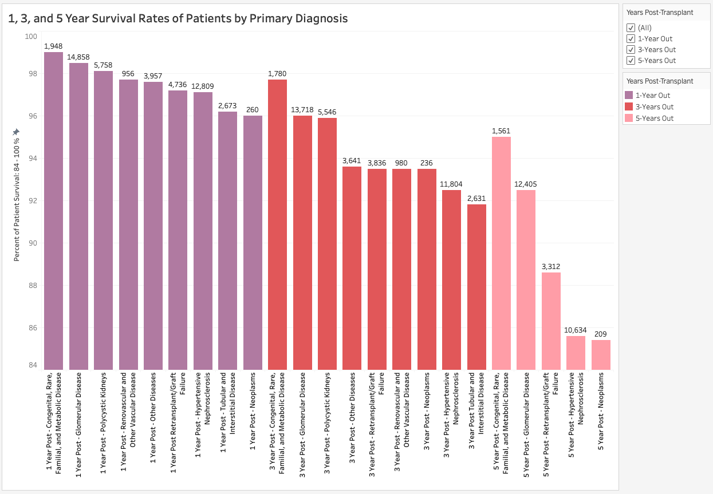
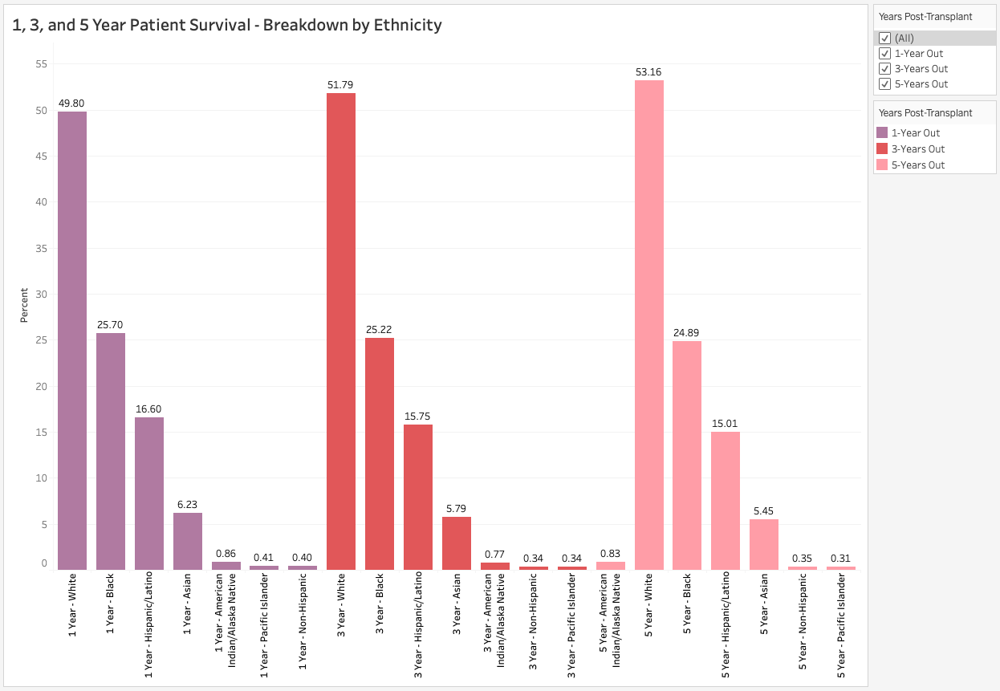
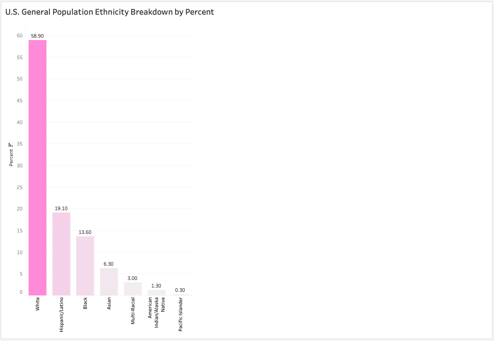

# Transplant survival

## Purpose
Right now, more than 103,000 people are in need of an organ transplant. So far this year (as of today) there has already been more than 25,000 organ transplants.  The OPTN - Organ Procurement and Transplantation Network oversees the recovery and distribution of solid organs in this country and is operated by UNOS - the United Network for Organ Sharing who manages the system, including policy, matching systems and overseeing local organ procurement organizations. In years past, patients were evaluated primarily on their medical urgency for placement on the organ transplant waitlist. This factor alone does not take into account many other important factors such as age and potential years of post-transplant survival which, along with some other factors, can contribute to a level of inequity in the allocation system, especially to vulnerable populations. 

We looked at survival rates of transplant recipients, especially when grouped by age, to see how this could potentially influence the allocation of the extremely precious and life-saving resource of donated organs. For the scope and timeline of this project, we narrowed our focus to include only kidney transplants - as they make up about 60% of all organ transplants in the U.S.

Recently, changes have been made and have very slowly begun to be implemented in how organs are allocated in an attempt to take into account these other factors and make things more equitable. We will look at survival rates of patients.


## Data Source
Our primary data source was from OPTN from July 2023. Much of data used is publicly available from the OPTN web site: [title](http://optn.transplant.hrsa.gov)
Specifically used were individual reports from 1988 to 2021 on kidney transplant patients by age based on transplant year with separate reports on primary diagnosis, blood type, ethnicity. Survival rates with these factors of 1, 3 and 5 years were also obtained.

An additional report on Survival Rates of all organ transplants by year and age group for 1, 3, 5, 10, 15 and 20 year survival rates from 1988 to 2021 was obtained by **special request** in May 2023.

There were some categories of data that we eliminated because it lacked information, such as HLA, KDPI, the type of kidney received (living vs. deceased donor) and wait times of recipients. Also lacking was de-identified, individual patient information. The most granular information available was by age group and transplant year.

### Additional Data
Additional data was obtained here:

- U.S. Population Blood Type Distribution Statistics: [](https://www.statista.com/statistics/1112664/blood-type-distribution-us/)

- Ethnicity of U.S. (as of July 1, 2022): [](https://www.census.gov/quickfacts/fact/table/US/RHI725222)
*note that the percentages total 102.5%*

 - Age Groups of U.S. (as of July 1, 2021): [](https://www.statista.com/statistics/241488/population-of-the-us-by-sex-and-age/)


## Analysis

Looking at patient survival rates of patient by primary diagnosis:



[See Tableau Visualizations for an interactive experience](https://public.tableau.com/app/profile/kathleen.anderson7696/viz/KidneyTransplantPatientSurvival-DiagnosisandEthnicity/Diagnosis)

We can see that patient survival rates for all primary diagnoses for all age groups were:
- Above 95% 1-year post transplant
- Above 91% 3-years post transplant
- Above 85% 5-year post transplant 
Also, while "Congenital, Rare, Familial, and Metabolic Disease" accounted for the highest survival rate for all cohorts, it did not account for the highest count by primary diagnosis. The highest count by primary diagnosis for all cohorts is "Glomerular Disease". Followed by Hypertensive Nephrosclerosis which together account for the majority of all diagnoses except in 5-years post, where the 2nd most common primary diagnosis is "Retransplant/Graft Failure".

Looking at the Patient Survival 1, 3, 5, years post-transplant by Ethnicity:

We can see that the highest percentage of survivors are in the White ethnic group, with Black and then Hispanic/Latino.



Compared to:

U.S. General Population Ethnicity Breakdown:


We can see that the White ethnic group is roughly representative of the general U.S. Population while the Black ethnicity survival group for all years accounts for almost double the total population, which tells us that more transplant recipients and survivors are Black than is representative of the general population.

## Outcomes/Conclusion:
Kidney transplant patient survival tends to be quite good, and they are better the younger the transplant patient.
With the new continous distribution model of deceased donor kidneys, younger patients on the waitlist could potentially receive kidneys sooner, perhaps improving the patient survival rate even further, as they potentially have the most life to live, thus improving long term survival statistics. Time will tell if the continuous distribution model will make this improvement.

For future analysis, areas we would have liked to analyze that may affect survival:
- Waitlist time of transplant survivors
- KDPI - kidney quality
- HLA or level of desensitization of transplant recipients
- More granular data - de-identified patient information
- Type of insurance - health equity issues in public vs. private insurance.  This would be to include Medicare which currently includes people under 65 if they receive Social Security Disability (such as ALS, legally blind) or **End-Stage Renal Failure** (which can lead to need for a kidney transplant). Treatment approved by Medicare will often result in private insurance automatically making the same treatment approval. 

## Acknowledgements
*"This work was supported in part by Health Resources and Services Administration contract HHSH250-2019-00001C. The content is the responsibility of the authors alone and does not necessarily reflect the views or policies of the Department of Health and Human Services, nor does mention of trade names, commercial products, or organizations imply endorsement by the U.S. Government."*
=======
# Prediction Models for Survival

We tried to create the model which can give us prediction about survivability rates for future years. For caculating the survival percentage we used **Linear Regression.** 

We created different models for 1,3,5,10,15 and 20 years survivals prediction we got preety good accuracy score from the model. The accuracy we got like this:

```
Accuracy Score for 1 Year Survival: 0.9995454531926082
r2 Score for 1 Year Survival: 0.9985563213311694
Accuracy Score for 3 Year Survival: 0.9991055295440959
r2 Score for 3 Year Survival: 0.9977813635074265
Accuracy Score for 5 Year Survival: 0.998681960585655
r2 Score for 5 Year Survival: 0.9965273821084251
Accuracy Score for 10 Year Survival: 0.9982129258191748
r2 Score for 10 Year Survival: 0.9962123188633075
Accuracy Score for 15 Year Survival: 0.996528616564367
r2 Score for 15 Year Survival: 0.9470567506571431
Accuracy Score for 20 Year Survival: 0.9952663840997822
r2 Score for 20 Year Survival: 0.9898742405681381
```
As we can see accuracy score is higher in lesser cohorts. Its because the survivability rate is very high and close to each other for lesser cohorts, which resultslesser  deviation.
The prediction plot for 5 year survival for 35-49 age group look like this. 


We also created a classification model to classify the survival rate of different ranges. We used **Random Forest** algorithm for this. We created following groups based on survival model.

Class A : 95-100%
Class B : 90-95%
Class C : 70-90%
Class D: bellow 70%

We get the following accuracy for that model:

```
Accuracy Score for 1 Year Survival: 0.9264705882352942
              precision    recall  f1-score   support

           A       0.96      0.96      0.96        48
           B       0.78      0.70      0.74        10
           C       0.83      1.00      0.91         5
           D       1.00      1.00      1.00         5

    accuracy                           0.93        68
   macro avg       0.89      0.91      0.90        68
weighted avg       0.93      0.93      0.93        68

-----------------------------------------------------------------
Accuracy Score for 3 Year Survival: 0.921875
              precision    recall  f1-score   support

           A       0.94      1.00      0.97        30
           B       1.00      0.91      0.95        11
           C       0.77      0.83      0.80        12
           D       1.00      0.82      0.90        11

    accuracy                           0.92        64
   macro avg       0.93      0.89      0.91        64
weighted avg       0.93      0.92      0.92        64

------------------------------------------------------------------
Accuracy Score for 5 Year Survival: 0.8666666666666667
              precision    recall  f1-score   support

           A       0.78      1.00      0.88        21
           B       0.78      0.54      0.64        13
           C       1.00      0.88      0.94        17
           D       1.00      1.00      1.00         9

    accuracy                           0.87        60
   macro avg       0.89      0.86      0.86        60
weighted avg       0.87      0.87      0.86        60

-------------------------------------------------------------------
Accuracy Score for 10 Year Survival: 0.78
              precision    recall  f1-score   support

           A       0.00      0.00      0.00         4
           B       0.55      0.55      0.55        11
           C       0.65      0.85      0.73        13
           D       1.00      1.00      1.00        22

    accuracy                           0.78        50
   macro avg       0.55      0.60      0.57        50
weighted avg       0.73      0.78      0.75        50

--------------------------------------------------------------------

Accuracy Score for 15 Year Survival: 0.925
              precision    recall  f1-score   support

           B       0.50      0.33      0.40         3
           C       0.90      0.95      0.92        19
           D       1.00      1.00      1.00        18

    accuracy                           0.93        40
   macro avg       0.80      0.76      0.77        40
weighted avg       0.92      0.93      0.92        40

--------------------------------------------------------------------
Accuracy Score for 20 Year Survival: 0.9354838709677419
              precision    recall  f1-score   support

           C       0.78      1.00      0.88         7
           D       1.00      0.92      0.96        24

    accuracy                           0.94        31
   macro avg       0.89      0.96      0.92        31
weighted avg       0.95      0.94      0.94        31

----------------------------------------------------------------------
```
We pulled the feature importance chart from this prediction model to get the idea which feature matters most in predicting the survivability. We can see
Graft Survivability and Congenital, Rare, Familial, and Metabolic are more imposrtant is predicting the actual patient survival. 


