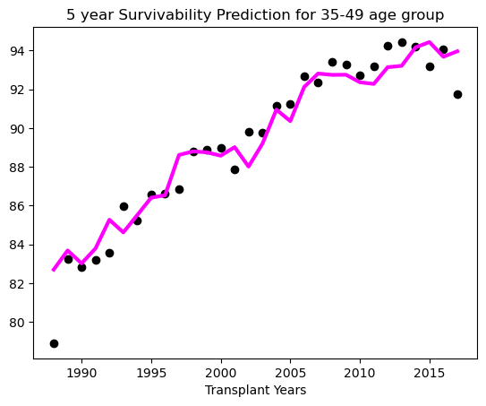
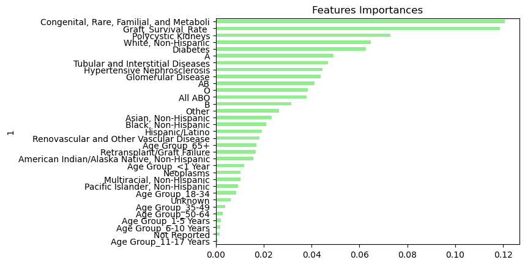

# Prediction Models for Survival

We tried to create the model which can give us prediction about survivability rates for future years. For caculating the survival percentage we used **Linear Regression.** 

We created different models for 1,3,5,10,15 and 20 years survivals prediction we got preety good accuracy score from the model. The accuracy we got like this:

```
Accuracy Score for 1 Year Survival: 0.9995454531926082
r2 Score for 1 Year Survival: 0.9985563213311694
Accuracy Score for 3 Year Survival: 0.9991055295440959
r2 Score for 3 Year Survival: 0.9977813635074265
Accuracy Score for 5 Year Survival: 0.998681960585655
r2 Score for 5 Year Survival: 0.9965273821084251
Accuracy Score for 10 Year Survival: 0.9982129258191748
r2 Score for 10 Year Survival: 0.9962123188633075
Accuracy Score for 15 Year Survival: 0.996528616564367
r2 Score for 15 Year Survival: 0.9470567506571431
Accuracy Score for 20 Year Survival: 0.9952663840997822
r2 Score for 20 Year Survival: 0.9898742405681381
```
As we can see accuracy score is higher in lesser cohorts. Its because the survivability rate is very high and close to each other for lesser cohorts, which resultslesser  deviation.
The prediction plot for 5 year survival for 35-49 age group look like this. 



We also created a classification model to classify the survival rate of different ranges. We used **Random Forest** algorithm for this. We created following groups based on survival model.

Class A : 95-100%
Class B : 90-95%
Class C : 70-90%
Class D: bellow 70%

We get the following accuracy for that model:

```
Accuracy Score for 1 Year Survival: 0.9264705882352942
              precision    recall  f1-score   support

           A       0.96      0.96      0.96        48
           B       0.78      0.70      0.74        10
           C       0.83      1.00      0.91         5
           D       1.00      1.00      1.00         5

    accuracy                           0.93        68
   macro avg       0.89      0.91      0.90        68
weighted avg       0.93      0.93      0.93        68

-----------------------------------------------------------------
Accuracy Score for 3 Year Survival: 0.921875
              precision    recall  f1-score   support

           A       0.94      1.00      0.97        30
           B       1.00      0.91      0.95        11
           C       0.77      0.83      0.80        12
           D       1.00      0.82      0.90        11

    accuracy                           0.92        64
   macro avg       0.93      0.89      0.91        64
weighted avg       0.93      0.92      0.92        64

------------------------------------------------------------------
Accuracy Score for 5 Year Survival: 0.8666666666666667
              precision    recall  f1-score   support

           A       0.78      1.00      0.88        21
           B       0.78      0.54      0.64        13
           C       1.00      0.88      0.94        17
           D       1.00      1.00      1.00         9

    accuracy                           0.87        60
   macro avg       0.89      0.86      0.86        60
weighted avg       0.87      0.87      0.86        60

-------------------------------------------------------------------
Accuracy Score for 10 Year Survival: 0.78
              precision    recall  f1-score   support

           A       0.00      0.00      0.00         4
           B       0.55      0.55      0.55        11
           C       0.65      0.85      0.73        13
           D       1.00      1.00      1.00        22

    accuracy                           0.78        50
   macro avg       0.55      0.60      0.57        50
weighted avg       0.73      0.78      0.75        50

--------------------------------------------------------------------

Accuracy Score for 15 Year Survival: 0.925
              precision    recall  f1-score   support

           B       0.50      0.33      0.40         3
           C       0.90      0.95      0.92        19
           D       1.00      1.00      1.00        18

    accuracy                           0.93        40
   macro avg       0.80      0.76      0.77        40
weighted avg       0.92      0.93      0.92        40

--------------------------------------------------------------------
Accuracy Score for 20 Year Survival: 0.9354838709677419
              precision    recall  f1-score   support

           C       0.78      1.00      0.88         7
           D       1.00      0.92      0.96        24

    accuracy                           0.94        31
   macro avg       0.89      0.96      0.92        31
weighted avg       0.95      0.94      0.94        31

----------------------------------------------------------------------
```
We pulled the feature importance chart from this prediction model to get the idea which feature matters most in predicting the survivability. We can see
Graft Survivability and Congenital, Rare, Familial, and Metabolic are more imposrtant is predicting the actual patient survival. 



