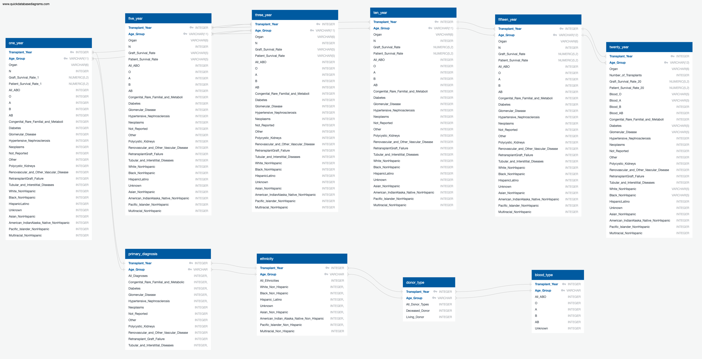

# Kidney Transplant Survival

## Team Introduction
This project was successful due to active participation from the following team members:  
#### Kathleen Anderson
#### Arthi Meera Subramanian
#### Jayati Chakraborty
#### Katherine Rhyno
#### Mary-Elizabeth Vogel

## Purpose
Right now, more than 103,000 people are in need of an organ transplant. So far this year (as of today) there has already been more than 25,000 organ transplants.  The OPTN - Organ Procurement and Transplantation Network oversees the recovery and distribution of solid organs in this country and is operated by UNOS - the United Network for Organ Sharing who manages the system, including policy, matching systems and overseeing local organ procurement organizations. In years past, patients were evaluated primarily on their medical urgency for placement on the organ transplant waitlist. This factor alone does not take into account many other important factors such as age and potential years of post-transplant survival which, along with some other factors, can contribute to a level of inequity in the allocation system, especially to vulnerable populations. 

We looked at survival rates of transplant recipients, especially when grouped by age, to see how this could potentially influence the allocation of the extremely precious and life-saving resource of donated organs. For the scope and timeline of this project, we narrowed our focus to include only kidney transplants - as they make up about 60% of all organ transplants in the U.S.

Recently, changes have been made and have very slowly begun to be implemented in how organs are allocated in an attempt to take into account these other factors and make things more equitable. We will look at survival rates of patients.

### Project Question

### Index
- [Technologies Used](#technologies-used)
- [Description of Datasources](#description-of-data-source)
    - [Additional Data](#additional-data)
    - [Data Exploration](#data-exploration)
- [Database](#database-1)
- [Tableau Dashboard](#tableau-dashboard)
---
- [Presentation](#presentation)

## Technologies Used
We used a variety of tools and technologies in order to complete this project. The most notable of which are listed below:
### Data Cleaning
Microsoft Excel, Jupyter Notebook, Python (pandas, numpy, re, os, calendar, datetime)
### Database
postgreSQL, pgAdmin, QuickDB
### Machine Learning Model
Python (sklearn, matplotlib, pandas, numpy)
### Analysis/Visualizations
Tableau, Python(pandas/matplotlib)

## Description of Datasources
Our primary data source was from OPTN from July 2023. Much of data used is publicly available from the OPTN web site: [title](http://optn.transplant.hrsa.gov)
Specifically used were individual reports from 1988 to 2021 on kidney transplant patients by age based on transplant year with separate reports on primary diagnosis, blood type, ethnicity. Survival rates with these factors of 1, 3 and 5 years were also obtained.

An additional report on Survival Rates of all organ transplants by year and age group for 1, 3, 5, 10, 15 and 20 year survival rates from 1988 to 2021 was obtained by **special request** in May 2023.

There were some categories of data that we eliminated because it lacked information, such as HLA, KDPI, the type of kidney received (living vs. deceased donor) and wait times of recipients. Also lacking was de-identified, individual patient information. The most granular information available was by age group and transplant year.

### Additional Data
Additional data was obtained here:

- U.S. Population Blood Type Distribution Statistics: 

- Ethnicity of U.S. (as of July 1, 2022): 
*note that the percentages total 102.5%*

 - Age Groups of U.S. (as of July 1, 2021): 

## Data Exploration
Our initial dataset came from the Scientific Registry of Transplant Recipients, which is operated by the Chronic Disease Research Group under contract from the US Department of Health and Human Services (HHS). SRTR is responsible for providing extensive data regarding the performance of various aspects of the national transplant system and a tier rating system that can aid patients in selecting their transplant center. 

We were able to pull data regarding patient demographics such as age, BMI, waitlist status, and hospital status prior to transplant procedures. This dataset also included graft survival information specific to transplant centers and regions in the United States. However, this information was not available at a patient level due to privacy protections and was already aggregated to a point that it was unusable for machine learning purposes.

Ultimately, we were able to pull data OPTN that became the basis for our final project.

## Database

## Tableau Dashboard

## Presentation